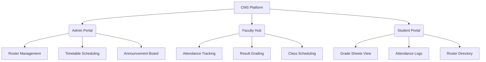

# 🎓 College Management System (CMS)

A professional, full-stack educational portal designed to automate administrative and academic workflows. The system features dedicated dashboards for **Administrators**, **Faculty Members**, and **Students** to streamline roster maintenance, attendance logging, timetable schedules, and notice dissemination.

---

## 🚀 Key Features



### 👔 Administrator Workspace
- ** Roster Management**: Create, view, search, and delete student/faculty records with dynamic pagination.
- ** Announcement Board**: Publish urgent campus announcements and normal news bulletins.
- ** System Configurations**: Sync administrative schedules and class timetable logs.

### 👩‍🏫 Faculty Hub
- ** Student Directory**: Search and access academic student files inside your designated modules.
- ** Attendance Logger**: Quickly log daily present/absent states for your classes.
- ** Grade Sheets Submission**: Submit and modify exam marks directly.

### 🎓 Student Portal
- ** Performance Cards**: Monitor GPA, exam percentages, and grade cards.
- ** Attendance Tracker**: Track presence history and overall class attendance rates.
- ** Schedule Viewer**: Access class timetables and campus announcements instantly.

---

## 🛠️ Technology Stack

| Layer | Technology | Purpose |
| :--- | :--- | :--- |
| **Frontend** | React 18 + TypeScript | UI view layer and component states |
| **Styling** | Vanilla CSS + TailwindCSS | Sleek Glassmorphism design tokens |
| **Components** | Radix UI + Lucide Icons | Modal triggers, select blocks, and vectors |
| **Bundler** | Vite HMR | Fast hot-reloads and optimized compilation |
| **Backend** | Express.js + Node.js | REST APIs and route middleware |
| **Database** | MongoDB Atlas (Mongoose ODM) | NoSQL document storage and user schemas |
| **Build/Deploy** | Vercel (Client) + Render (Server) | CI/CD pipelines and deployment orchestrations |

---

## 📂 Architecture Overview

```text
├── public/                 # Static assets (favicons, manifest)
├── server/                 # Express backend source
│   ├── src/
│   │   ├── controllers/    # Route controllers
│   │   ├── models/         # Mongoose schemas
│   │   ├── routes/         # API endpoints
│   │   └── index.ts        # Server entry point
│   ├── package.json
│   └── tsconfig.json
├── src/                    # React frontend source
│   ├── components/         # Shared UI & Layout components
│   ├── hooks/              # Reusable React hooks
│   ├── pages/              # Route pages (Admin, Faculty, Student)
│   ├── index.css           # Global design system & theme variables
│   └── main.tsx            # React entry point
├── render.yaml             # Render deployment orchestrator blueprint
└── vercel.json             # Vercel SPA router config
```

---

## 💻 Local Setup & Installation

### Prerequisites
- Node.js (v18 or higher)
- MongoDB Atlas cluster (or local MongoDB database instance)

### 1. Roster Installation
Install dependencies in the root and server directory:
```bash
# Install frontend packages
npm install

# Install backend packages
npm --prefix server install
```

### 2. Configure Environment Files
Set up your environment parameters by duplicating the sample configurations:
- Copy `.env.example` to `.env` in the root folder.
- Copy `server/.env.example` to `server/.env` in the server folder.

Fill in your MongoDB credentials and secret strings safely in the newly created `.env` files.

### 3. Generate Mock Data
Initialize your database with sample records:
```bash
npm run seed
```
> [!NOTE]
> Running the seeder script generates isolated, secure test credentials for demo roles, outputting details to the terminal during execution.

### 4. Start Development Servers
Run client and server concurrently from the project root:
```bash
# Spin up both Express API and Vite Dev servers
npm run dev
```
- Frontend starts at: `http://localhost:5173`
- Backend API starts at: `http://localhost:5000`

---

## 🌐 Production Deployment

### Backend on Render
1. Push your code changes to GitHub.
2. Link your repository in Render and create a **Web Service**.
3. Render automatically reads the workspace [render.yaml](file:///c:/Users/ASUS/Desktop/CMS/render.yaml) blueprint to configure your build, build commands, and start environments automatically.

### Frontend on Vercel
1. Create a new project on Vercel and import your repository.
2. Vercel automatically reads [vercel.json](file:///c:/Users/ASUS/Desktop/CMS/vercel.json) to configure SPA routing rewrites.
3. Add the environment variable `VITE_API_URL` pointing to your Render Web Service.
